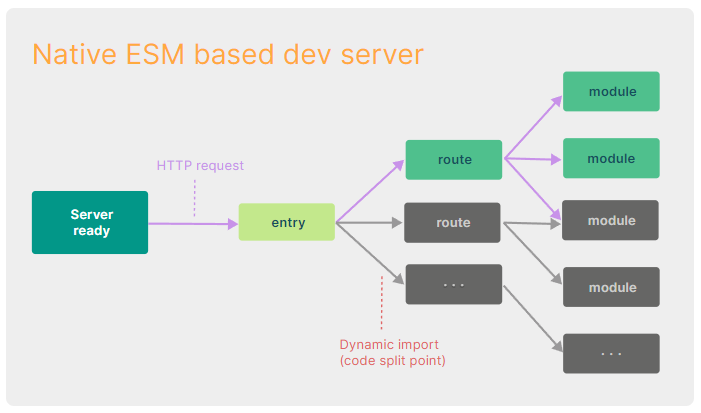

# React란?
- UI를 만들기 위한 JavaScript라이브러리
- 인터렉션이 많은 웹앱을 개발하기 위해 사용

## 프레임워크 VS 라이브러리
### 프레임워크
-  어떠한 앱을 만들기 위해 필요한 대부분의 것을 가지고 있는 것

### 라이브러리
- 어떠한 특정 기능을 모듈화 해놓은 것.
- 리액트는 전적으로 UI를 렌더링 하는 데 관여하기 때문에 라이브러리이다.

### 페이지를 전환하거나, 상태 관리를 하고싶다면...
- 화면을 바꾸는 라우팅은 react-router-dom 모듈을 사용한다.
- 상태 관리를 위해서는 redux,mobx 등 여러 모듈을 사용한다.
- 이렇게 다른 라이브러리의 도움을 받는 리액트 생태계가 존재한다.

## React를 사용하는 이유
- 현재 리액트를 사용하고 있는 국내 기업은 굉장히 많다.
- 상대적으로 배우기 쉬운 라이브러리
- 여러 기능들을 위해 이미 만들어져 있는 라이브러리 환경
- 많은 기업들의 사용으로 검증이 된 라이브러리(대표적으로 페이스북)

# Node.js
## Node.js란?
- 크롬 V8 자바스크립트 엔진으로 빌드한 자바스크립트 런타임이다.
- 웹 브라우저 환경이 아닌 곳에서도 자바스크립트를 사용하여 연산 할 수 있다.

## React로 작업하기 위해 Node를 사용하는 이유
- Node.js를 설치하면 NPM(Node Package Manager)이 같이 설치되는데 NPM을 통해 React 개발에 필요한 모듈들을 다운받아 사용할 수 있다.
- npm은 package.json이라는 JSON파일을 사용해 프로젝트의 정보와 의존성을 관리하는데, 이 파일을 통해 팀 내에서 의존성 환경을 통일하고 개발 환경을 빠르게 구축할 수 있다.

## nodeJS 설치하기
- 개발환경으로 18+ 또는 20+ 버전의 Node.js를 요구한다.


- LTS(Long Term Service) : 안정적인 버전입니다.

# Vite
<p align="center">
  
</p>

- Vue의 창시자 Evan You가 만든 새로운 프론트엔드 도구로 프랑스어로 "빠르다(Quick)"를 의미한다.
- 빠르고 간결한 모던 웹 프로젝트 개발 경험에 초점을 맞춰 탄생한 빌드 도구이다.
- 현재 Vue, React, Svelte등의 주요 프론트엔드 라이브러리, 프레임워크 커뮤니티에서 주목하고 있다.

### 빌드도구
- 프로젝트 빌드 과정의 전체적인 흐름을 관리하기 위한 도구로, 보통 번들러를 기본 포함하고 개발 서버나 린팅, 테스트 등의 추가로 개발에 필요한 여러 도구를 가지고 있다.

## Vite가 나온 배경
### 너무 긴 서버 구동
- 콜드 스타트 방식을 통해 개발 서버를 구동할 때, 번들러 기반의 도구는 애플리케이션의 모든 소스 코드에 대해서 크롤링 및 빌드 작업을 마쳐야지만 실제 페이지를 제공했다.

#### 번들러(Bundler)
- 브라우저 모듈 시스템이 아직 표준화되지 않았던 시기에는, 여러 자바스크립트 파일을 단순하게 \<script\> 태그로 연결하는 방식을 사용했는데, 이런 방식은 전역 오염이나 의존성 관리가 어려워지는 등의 여러 문제가 있었다.
- 번들러는 웹 애플리케이션을 개발하기 위해 필요한 HTML, CSS, JS등의 파편화(모듈화된) 자원들을 모아서, 하나 혹은 최적의 수로 파일을 결합(번들링)하는 도구이다.
- 결합을 위해 프로젝트를 해석하는 과정에서, 불필요한 주석이나 공백 제거, 난독화, 파일 압축 등의 기본적인 작업뿐만 아니라, 최신 문법이나 기타 개발에 편리한 특수 기능 들을 브라우저가 지원하는 형태로 변환하는 작업도 수행할 수 있도록 확장되었다.

#### ※콜드 스타트란?
- 최초로 실행되어 이전에 캐싱한 데이터가 없는 경우를 의미한다.
- vit는 애플리케이션의 모듈을 dependencies와 source code, 두 카테고리로 나눠 개발 서버의 시간을 개선한다.
  - dependencies
    - 개발 시 내용이 바뀌지 않을 일반적인 JavaScript소스 코드이다.
    - 기존 번들러로 컴포넌트 라이브러리와 같이 몇 백 개의 JavaScript 모듈을 갖고 있는 큰 dependency에 대한 번들링 과정이 매우 비효율적이고 많은 시간이 필요했다.
    - Vite는 Esbuild를 사용해 이런 문제를 해결했다.
    - Go로 작성된 Esbuild는 기존 Webpack 같은 번들러에 비해 10 ~ 100배 빠른 속도를 제공한다.

  - Source code
    - JSX, CSS같이 컴파일링이 필요하고, 수정 또한 매우 잦은 Non-plain JavaScript소스코드이다.
    - Vite는 Native ESM을 통해서 소스코드를 제공한다.
    - 브라우저가 번들러의 작업의 일부를 차지할 수 있도록 하는 방식이다.
    - Vite는 브라우저가 요청하는 대로 소스 코드를 변환하고 제공하는 방식이다.
    - 자체적으로 Dynamic import를 해서 나머지 코드는 실제 사용되는 경우에만 처리된다.



### 느렸던 소스 코드 갱신
- 기존의 번들러 기반으로 개발했을 때, 소스 코드를 업데이트 하게 되면 다시 번들링 과정을 거쳐야 했다.
- 따라서 서비스가 커질수록 소스 코드 갱신 시간 또한 선형적으로 증가하게 된다.
- Vite는 수정된 모듈과 관련된 부분만 교체를 진행하고, 브라우저에서 해당 모듈을 요청하면 교체된 모듈을 전달하는 방식이다.

## Vite 시작하기

### 프로젝트를 저장할 폴더 만들기


### vscode 설치하기


### vscode에서 생성한 폴더를 오픈한다.


### 터미널을 연다


```js
npm create vite@latest //Vite를 통해 환경을 구성하는 명령어
npm create vite@latest 프로젝트명 --template react //프로젝트명이나 템플릿을 미리 지정할 수 있다.
```

### 라이브러리를 선택한다.


### 언어를 선택한다.


#### SWC
- Rust 기반 웹용 플랫폼이다.

### 프로젝트 생성 완료


### 프로젝트 실행하기
```node
npm dev
```
### Vite가 제공하는 명령어
- Vite를 사용하여 생성한 JavaScript 기반 React 프로젝트에서 package.json 파일을 열면 다음과 같이 프로젝트에서 사용할 수 있는 명령어를 확인 할 수 있다.
```js
{
  "scripts": {
    "dev": "vite", // 개발 서버를 실행합니다. (`vite dev` 또는 `vite serve`로도 시작이 가능합니다.)
    "build": "vite build", // 배포용 빌드 작업을 수행합니다.
    "preview": "vite preview" // 로컬에서 배포용 빌드에 대한 프리뷰 서버를 실행합니다.
  }
}
```

### 유용한 플러그인
#### eslint
- 문법적인 오류등을 파악해 표시를 달아주는 도구이다.
```js
npm install --save-dev eslint eslint-config-airbnb-base eslint-plugin-import eslint-plugin-html eslint-config-prettier
```
#### prettier
- 세미콜론, 줄바꿈, 들여쓰기 등의 스타일을 교정해주는 도구이다.

#### eslint-config-airbnb-base
- Airbnb의 스타일 가이드를 .eslintrc.json에 확장해주는 플러그인이다.

#### eslint-plugin-import
- ES6+ import/export를 지원해주는 플러그인

#### eslint-plugin-html
- HTML파일에 포함된 인라인 자바스크립트를 지원해주는 플러그인이다.

#### eslint-config-prettier
- eslint 설정 중에서 prettier와 충돌하는 부분을 비활성화 한다.

# 컴포넌트 기반 아키텍처
- 현대 웹 개발에서 중심적인 역할을 하는 개발 패턴이다.
- 이 아키텍처는 애플리케이션을 재사용 가능한 개별 단위, 즉 컴포넌트로 분리하여 개발하는 방식이다.

## 컴포넌트
- UI를 구성하는 조각(piece)
- 독립적으로 분리되어 재사용 됨을 목적으로 한다.
- React 앱에서 컴포넌트는 개별적인 JavaScript파일로 분리되어 관리된다.
- 예를 들어 소셜미디어를 만든다고 가정했을 때, 여러 페이지에서 공통으로 사용되는 네비게이션 바, 사이드 바, 포스트 카드 등을 컴포넌트로 만들어 재사용할 수 있다.

## 컴포넌트 기반 아키텍처의 장점
- 코드의 재사용성, 유지보수성 및 확장성의 향상
- 컴포넌트를 사용하면 개발자는 복잡한 UI를 구성하는 데 필요한 시간을 대폭 줄일 수 있으며, 애플리케이션의 다른 부분에서 동일한 컴포넌트를 재사용할 수 있다.
- 웹 개발의 복잡성을 관리하고, 대규모 애플리케이션 개발을 용이하게 한다.
- 팀 내에서의 협업도 원활해진다. 각 개발자는 특정 컴포넌트의 개발 및 유지보수에 집중할 수 있어, 프로젝트 관리가 훨씬 수월해진다.

## 도입시 고려사항
### 컴포넌트의 재사용성을 최대화하기 위한 설계이다.
- 컴포넌트는 고도로 일반화되어 다양한 환경에서 사용될 수 있도록 설계 되어야 한다.

### 상태관리의 복잡성
- 애플리케이션의 규모가 커질수록 상태를 효과적으로 관리하는 것이 어려워질 수 있으므로 상태관리 라이브러리의 사용을 고려해야 한다.

### 컴포넌트 간의 의존성 관리
- 컴포넌트가 서로 강하게 결합되어 있으면 재사용성이 떨어지고 유지보수가 어려워 질 수 있다.

### 컴포넌트의 테스트 용이성
- 각 컴포넌트는 독립적으로 테스트 될 수 있어야 하며, 이는 개발 과정에서 버그를 조기에 발견하고 수정하는 데 도움이 된다.

### 컴포넌트의 문서화
- 프로젝트의 가독성과 이해도를 높이는데 중요하다.
- 컴포넌트의 사용법, 입력받을 props, 상태 관리 방법을 명확하게 문서화하는 것이 좋다.


### 함수형 컴포넌트
- 컴포넌트 외부로 속성(props)을 전달 받아 어떻게 UI를 구성해야 할지 설정하여 React 요소(JSX를 Babel이 변환 처리)로 반환하는 문법 구문을 사용하는 컴포넌트
```js
function Welcome(props){
    return (<h1>안녕, {props.name}</h1>);
}

export default Welcome;
```

### 클래스형 컴포넌트
- 자바스크립트의 ES6의 class라는 것을 사용해서 만들어진 형태의 컴포넌트이다.
- 컴포넌트의 구성 요소, 리액트 생명주기를 모두 포함하고 있다.
- 클래스형 컴포넌트의 경우 함수형 컴포넌트에 비해 몇가지 추가적인 기능을 가지고 있다.
```js
class Welcome extends React.Component{
	render(){
    	return <h1>안녕, {this.props.name}</h1>;
    }
}
```

## JSX
- JSX(JavaScript Syntax eXtension)
- React 엘리먼트(element)를 생성하는 JavaScript 확장 문법(React 요소는 실제 DOM요소가 아니라 JavaScript 객체이므로)

### JSX문법
1. 반드시 부모 요소 하나가 감싸는 형태여야 한다.
```js
// div를 사용 하였기 때문에 스타일 적용시 작성한 코드를 div로 한번 더 감쌌다는 부분을 고려해야 한다.
function App() {
	return (
		<div>
			<div>Hello</div>
			<div>GodDaeHee!</div>
		</div>
	);
}


function App() {
	return (
		<>
			<div>Hello</div>
			<div>GodDaeHee!</div>
		</>
	);
}
```

2. 자바스크립트 표현식
- JSX 안에서도 자바스크립트 표현식을 사용할 수 있다.
- 자바스크립트 표현식을 JSX내부에서 사용하려면 {}를 사용하면 된다.
```js
function App() {
	const name = 'GodDaeHee';
	return (
		<div>
			<div>Hello</div>
			<div>{name}!</div>
		</div>
	);
}
```

3. if,for문 대신 삼항 연산자 사용
- if문과 for문은 JavaScript 표현식이 아니기 때문에 JSX 내부 자바스크립트 표현식에서는 사용할 수 없다.
- 외부에서 사용하거나, {}안에서 삼항 연산자를 사용한다.
```js
//방법1 외부에서 사용
function App() {
	let desc = '';
	const loginYn = 'Y';
	if(loginYn === 'Y') {
		desc = <div>GodDaeHee 입니다.</div>;
	} else {
		desc = <div>비회원 입니다.</div>;
	}
	return (
		<>
			{desc}
		</>
	);
}

//방법2 내부에서 사용
function App() {
	const loginYn = 'Y';
	return (
		<>
			<div>
				{loginYn === 'Y' ? (
					<div>GodDaeHee 입니다.</div>
				) : (
					<div>비회원 입니다.</div>
				)}
			</div>
		</>
	);
}

//방법3 AND연산자(&&)사용
// 조건이 만족하지 않을 경우 아무것도 노출되지 않는다.
function App() {
	const loginYn = 'Y';
	return (
		<>
			<div>
				{loginYn === 'Y' && <div>GodDaeHee 입니다.</div>}
			</div>
		</>
	);
}
```

4. ReactDOM은 HTML 어트리뷰트 이름 대신 camelCase 프로퍼티 명명 규칙을 사용한다.
```js
//JSX에서 자바스크립트 문법을 쓰려면 {}를 써야 하기 때문에, 스타일을 적용할 때에도 객체 형태로 넣어줘야 한다.
//카멜 표기법으로 작성해야 한다. (font-size -> fontSize)
function App() {
	const style = {
		backgroundColor: 'green',
		fontSize: '12px'
	}
	return (
		<div style={style}>Hello, GodDaeHee!</div>
	);
}

//class 대신 className
//일반 HTML에서 CSS클래스를 사용할 때에는 class라는 속성을 사용한다.
//JSX에서는 class가 아닌 className을 사용한다.
function App() {
	const style = {
		backgroundColor: 'green',
		fontSize: '12px'
	}
	return (
		<div className="testClass">Hello, GodDaeHee!</div>
	);
}
```
5. JSX 내에서 주석 사용 방법
- {/* ... */}와 같은 형식을 사용한다.
```js
function App() {
	return (
		<>
			{/* 주석사용방법 */}
			<div>Hello, GodDaeHee!</div>
		</>
	);
}
```

### 주의사항
- 태그는 반드시 닫는다.
- 최상단에서는 반드시 div 혹 Fragment<>로 감싸줘야 함
- JSX 안에서 자바스크립트 값을 사용하고 싶을 때는 {}를 사용
- 조건부 렌더링을 하고 싶으면 &&연산자나 삼항연산자를 사용
- 인라인 스타일링은 항상 객체 형식으로 작성
- 별도의 스타일 파일을 만들었으면 class 대신 className 사용
- 주석은 {/* */}을 사용

## Vite로 만든 React 프로젝트의 구조
- 만들어진 Vite 프로젝트를 보면 index.html이 public 디렉토리가 아닌 프로젝트의 루트(root)에 위치해 있는 것을 볼 수 있다.
- 추가적인 번들링 과정 없어 index.html 파일이 앱의 진입점이 되게끔 하기 위함이다.

