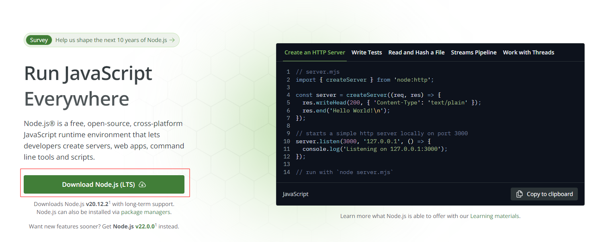
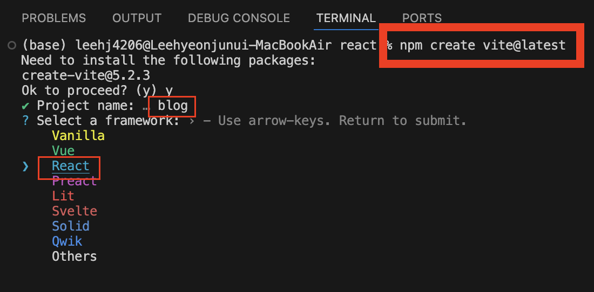

# Node.js
## Node.js란?
- 크롬 V8 자바스크립트 엔진으로 빌드한 자바스크립트 런타임으로서, 웹 브라우저 환경이 아닌 곳에서도 자바스크립트를 사용하여 연산 할 수 있다.

## React 설치 시 Node.js가 필요한 이유
- 리액트는 웹 브라우저에서 실행되는 코드여서 Node.js와 직접적인 연관은 없지만, 프로젝트를 개발하는 데 주요 도구들이 Node.js를 사용하기 때문에 필요하다.
- 이 때 사용하는 개발 도구는 바벨, 모듈화된 코드를 한 파일로 합치고 코드를 수정할 때 마다 웹 브라우저를 리로딩하는 등 여러기능을 가진 웹팩 등이 있다.

## nodeJS 설치하기
- 개발환경으로 18+ 또는 20+ 버전의 Node.js를 요구한다.


- LTS(Long Term Service) : 안정적인 버전입니다.
# Vite
<p align="center">
  
</p>

- Vue의 창시자 Evan You가 만든 새로운 프론트엔드 도구로 프랑스어로 "빠르다(Quick)"를 의미한다.
- 빠르고 간결한 모던 웹 프로젝트 개발 경험에 초점을 맞춰 탄생한 빌드 도구이다.
- 현재 Vue, React, Svelte등의 주요 프론트엔드 라이브러리, 프레임워크 커뮤니티에서 주목하고 있다.

### 빌드도구
- 프로젝트 빌드 과정의 전체적인 흐름을 관리하기 위한 도구로, 보통 번들러를 기본 포함하고 개발 서버나 린팅, 테스트 등의 추가로 개발에 필요한 여러 도구를 가지고 있다.

## Vite가 나온 배경
### 너무 긴 서버 구동
- 콜드 스타트 방식을 통해 개발 서버를 구동할 때, 번들러 기반의 도구는 애플리케이션의 모든 소스 코드에 대해서 크롤링 및 빌드 작업을 마쳐야지만 실제 페이지를 제공했다.

#### 번들러(Bundler)
- 브라우저 모듈 시스템이 아직 표준화되지 않았던 시기에는, 여러 자바스크립트 파일을 단순하게 \<script\> 태그로 연결하는 방식을 사용했는데, 이런 방식은 전역 오염이나 의존성 관리가 어려워지는 등의 여러 문제가 있었다.
- 번들러는 웹 애플리케이션을 개발하기 위해 필요한 HTML, CSS, JS등의 파편화(모듈화된) 자원들을 모아서, 하나 혹은 최적의 수로 파일을 결합(번들링)하는 도구이다.
- 결합을 위해 프로젝트를 해석하는 과정에서, 불필요한 주석이나 공백 제거, 난독화, 파일 압축 등의 기본적인 작업뿐만 아니라, 최신 문법이나 기타 개발에 편리한 특수 기능 들을 브라우저가 지원하는 형태로 변환하는 작업도 수행할 수 있도록 확장되었다.

#### ※콜드 스타트란?
- 최초로 실행되어 이전에 캐싱한 데이터가 없는 경우를 의미한다.
- vit는 애플리케이션의 모듈을 dependencies와 source code, 두 카테고리로 나눠 개발 서버의 시간을 개선한다.
  - dependencies
    - 개발 시 내용이 바뀌지 않을 일반적인 JavaScript소스 코드이다.
    - 기존 번들러로 컴포넌트 라이브러리와 같이 몇 백 개의 JavaScript 모듈을 갖고 있는 큰 dependency에 대한 번들링 과정이 매우 비효율적이고 많은 시간이 필요했다.
    - Vite는 Esbuild를 사용해 이런 문제를 해결했다.
    - Go로 작성된 Esbuild는 기존 Webpack 같은 번들러에 비해 10 ~ 100배 빠른 속도를 제공한다.

  - Source code
    - JSX, CSS같이 컴파일링이 필요하고, 수정 또한 매우 잦은 Non-plain JavaScript소스코드이다.
    - Vite는 Native ESM을 통해서 소스코드를 제공한다.
    - 브라우저가 번들러의 작업의 일부를 차지할 수 있도록 하는 방식이다.
    - Vite는 브라우저가 요청하는 대로 소스 코드를 변환하고 제공하는 방식이다.
    - 자체적으로 Dynamic import를 해서 나머지 코드는 실제 사용되는 경우에만 처리된다.


### 느렸던 소스 코드 갱신
- 기존의 번들러 기반으로 개발했을 때, 소스 코드를 업데이트 하게 되면 다시 번들링 과정을 거쳐야 했다.
- 따라서 서비스가 커질수록 소스 코드 갱신 시간 또한 선형적으로 증가하게 된다.
- Vite는 수정된 모듈과 관련된 부분만 교체를 진행하고, 브라우저에서 해당 모듈을 요청하면 교체된 모듈을 전달하는 방식이다.

## Vite 시작하기

### 프로젝트를 저장할 폴더 만들기


### vscode 설치하기


### vscode에서 생성한 폴더를 오픈한다.


### 터미널을 연다


```js
npm create vite@latest //Vite를 통해 환경을 구성하는 명령어
npm create vite@latest 프로젝트명 --template react //프로젝트명이나 템플릿을 미리 지정할 수 있다.
```

### 라이브러리를 선택한다.


### 언어를 선택한다.


#### SWC
- Rust 기반 웹용 플랫폼이다.

### 프로젝트 생성 완료


### 프로젝트 실행하기
```node
npm dev
```


### Vite가 제공하는 명령어
- Vite를 사용하여 생성한 JavaScript 기반 React 프로젝트에서 package.json 파일을 열면 다음과 같이 프로젝트에서 사용할 수 있는 명령어를 확인 할 수 있다.
```js
{
  "scripts": {
    "dev": "vite", // 개발 서버를 실행합니다. (`vite dev` 또는 `vite serve`로도 시작이 가능합니다.)
    "build": "vite build", // 배포용 빌드 작업을 수행합니다.
    "preview": "vite preview" // 로컬에서 배포용 빌드에 대한 프리뷰 서버를 실행합니다.
  }
}
```

### 유용한 플러그인
#### eslint
- 문법적인 오류등을 파악해 표시를 달아주는 도구이다.
```js
npm install --save-dev eslint eslint-config-airbnb-base eslint-plugin-import eslint-plugin-html eslint-config-prettier
```
#### prettier
- 세미콜론, 줄바꿈, 들여쓰기 등의 스타일을 교정해주는 도구이다.

#### eslint-config-airbnb-base
- Airbnb의 스타일 가이드를 .eslintrc.json에 확장해주는 플러그인이다.

#### eslint-plugin-import
- ES6+ import/export를 지원해주는 플러그인

#### eslint-plugin-html
- HTML파일에 포함된 인라인 자바스크립트를 지원해주는 플러그인이다.

#### eslint-config-prettier
- eslint 설정 중에서 prettier와 충돌하는 부분을 비활성화 한다.