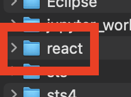
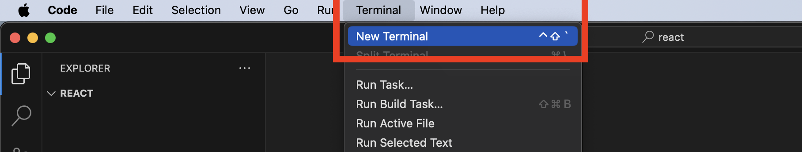

# 리액트 시작하기
## Vite

- Vue의 창시자 Evan You가 만든 새로운 프론트엔드 도구로 프랑스어로 "빠르다(Quick)"를 의미한다.
- 빠르고 간결한 모던 웹 프로젝트 개발 경험에 초점을 맞춰 탄생한 빌드 도구이다.
- 현재 Vue, React, Svelte등의 주요 프론트엔드 라이브러리, 프레임워크 커뮤니티에서 주목하고 있다.

## Vite의 특징
- 로컬에서 개발할 때 번들링을 하지 않고 ESM방식을 사용하기 때문에 로컬 서버 구동 속도가 매우빠르다.

### 번들링
- 여러개의 파일을 하나로 합쳐주거나 의미 있는 단위로 묶어주는 것
- 프론트엔드 개발 생태계에서는 모듈 번들러로 웹팩을 사용하고 있다.

## Vite 시작하기

### nodeJS 설치하기


### 프로젝트를 저장할 폴더 만들기


### vscode 설치하기


### vscode에서 생성한 폴더를 오픈한다.


### 터미널을 연다


```js
npm create vite@latest
npm create vite@latest 프로젝트명 --template react
```

### 라이브러리를 선택한다.


### 언어를 선택한다.


### 프로젝트 생성 완료

- 만들어진 Vite 프로젝트를 보면 index.html이 public 디렉토리가 아닌 프로젝트의 루트(root)에 위치해 있는 것을 볼 수 있다.
- 추가적인 번들링 과정 없어 index.html 파일이 앱의 진입점이 되게끔 하기 위함이다.


- 실행하기
```node
npm dev
```

### Vite가 제공하는 명령어
```js
{
  "scripts": {
    "dev": "vite", // 개발 서버를 실행합니다. (`vite dev` 또는 `vite serve`로도 시작이 가능합니다.)
    "build": "vite build", // 배포용 빌드 작업을 수행합니다.
    "preview": "vite preview" // 로컬에서 배포용 빌드에 대한 프리뷰 서버를 실행합니다.
  }
}
```

### 유용한 플러그인
#### eslint
- 문법적인 오류등을 파악해 표시를 달아주는 도구이다.
```js
npm install --save-dev eslint eslint-config-airbnb-base eslint-plugin-import eslint-plugin-html eslint-config-prettier
```
#### prettier
- 세미콜론, 줄바꿈, 들여쓰기 등의 스타일을 교정해주는 도구이다.

#### eslint-config-airbnb-base
- Airbnb의 스타일 가이드를 .eslintrc.json에 확장해주는 플러그인이다.

#### eslint-plugin-import
- ES6+ import/export를 지원해주는 플러그인

#### eslint-plugin-html
- HTML파일에 포함된 인라인 자바스크립트를 지원해주는 플러그인이다.

#### eslint-config-prettier
- eslint 설정 중에서 prettier와 충돌하는 부분을 비활성화 한다.