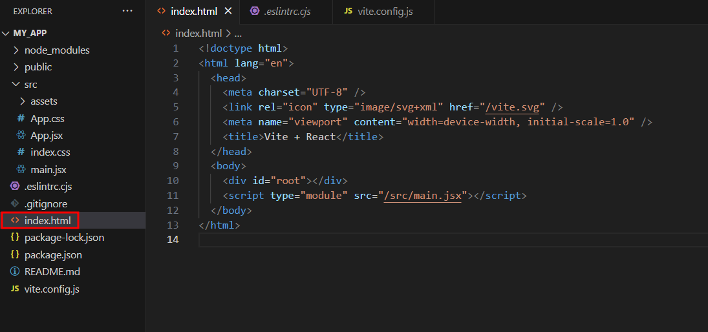

## React란?
- UI를 구성하는 JavaScript라이브러리
- 웹 앱(Web App)또는 네이티브 앱(Native App)
- 유지보수를 쉽게, DOM 관리
- 성능최적화를 쉽게
- 컴포넌트에 집중

## 컴포넌트
- UI를 구성하는 조각(piece)
- 독립적으로 분리되어 재사용 됨을 목적
- React 앱에서 컴포넌트는 개별적인 JavaScript파일로 분리되어 관리

## 함수형 컴포넌트
- 컴포넌트 외부로 속성(props)을 전달 받아 어떻게 UI를 구성해야 할지 설정하여 React 요소(JSX를 Babel이 변환 처리)로 반환하는 문법 구문을 사용하는 컴포넌트

## JSX
- React 엘리먼트(element)를 생성하는 JavaScript 확장 문법(React 요소는 실제 DOM요소가 아니라 JavaScript 객체이므로)

### 주의사항
- 태그는 반드시 닫는다.
- 최상단에서는 반드시 div 혹 Fragment<>로 감싸줘야 함
- JSX 안에서 자바스크립트 값을 사용하고 싶을 때는 {}를 사용
- 조건부 렌더링을 하고 싶으면 &&연산자나 삼항연산자를 사용
- 인라인 스타일링은 항상 객체 형식으로 작성
- 별도의 스타일 파일을 만들었으면 class 대신 className 사용
- 주석은 {/* */}을 사용

## Vite로 만든 React 프로젝트의 구조
- 만들어진 Vite 프로젝트를 보면 index.html이 public 디렉토리가 아닌 프로젝트의 루트(root)에 위치해 있는 것을 볼 수 있다.
- 추가적인 번들링 과정 없어 index.html 파일이 앱의 진입점이 되게끔 하기 위함이다.

- index.html: 웹 브라우저에 로드된는 정적 HTML파일이다. React 애플리케이션을 초기화하고 렌더링하는 중요한 역할을 수행한다.
- package.json: 프로젝트의 의존성과 스크립트를 정의한 파일입니다.
- public: 정적 파일을 저장하는 디렉토리입니다.
- src: React 애플리케이션의 소스코드를 저장하는 디렉토리입니다.
- src/main.tsx: React 애플리케이션의 논리적인 진입점입니다.
- tsconfig.json: TypeScript 설정 파일입니다.
- vite.config.js: Vite 설정 파일입니다.